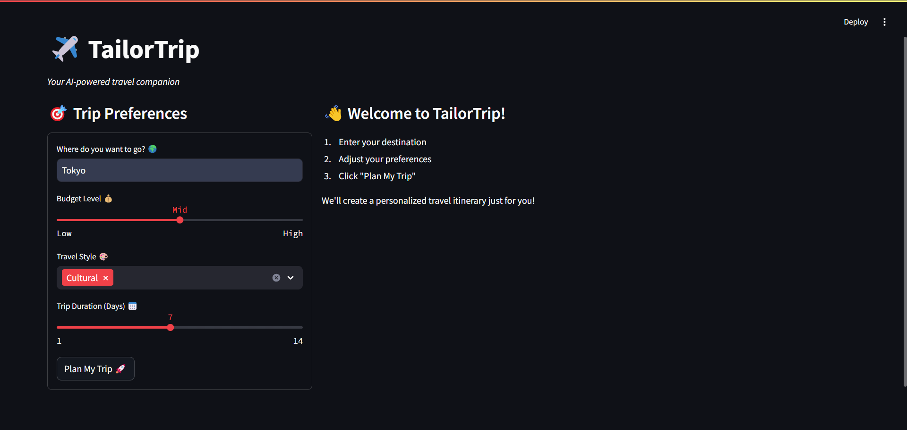
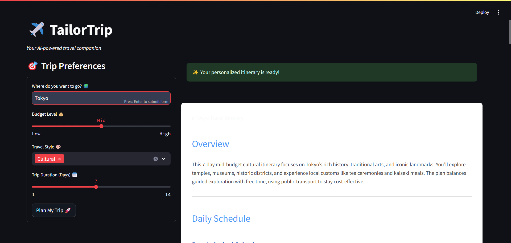

## Demo
這個項目整體大綱是用`OpenManus`結合`Deepseek-R1`api生成的的，項目代碼是用`windsurf`結合`Claude 3.5 Sonnect`，旅行計劃planner的api是`Qwen/QwQ-32B`。

### 運行應用
```shell
conda create --name tailortrip python=3.9.12
conda activate tailortrip
pip install -r requirements.txt
streamlit run main.py
```


### 開始界面


### 輸出界面


### 示例輸出

[示例輸出](./data/results/Tokyo_20250324_181114_result.md)

## Prompt
```
下面是一个项目high level的描述：
我想要做一个基于llm的自动化旅游计划或者旅游推荐的应用 文本数据来源自包括但不限于社交媒体的user generated content的帖子 属于文本数据 你需要根据不同用户画像定制化旅游攻略 比如哪个时间点乘坐什么交通工具去某一个景点 景点有什么玩乐 预估费用等 项目暂定的workflow如下：
1. 爬虫 从社交媒体爬取目标旅游地相关的数据
2. 过滤和去重 筛选出跟目的地旅游强相关的帖子 包含景点 购物 打卡 拍照 文娱 体育 会展 等， 去除广告和废文 
3. 用户画像分析 可以预先让用户填写简单的问卷或者从用户的浏览行为以及其他关联的社交媒体的帖子发言特征中分析用户画像
4. 思维链 在生成旅游计划的时候 需要把思维链结合llm一起 在特定步骤的时候 llm需要能感知回答某个问题需要额外的user input 并且生成问题反问回用户
5. 知识库问答 对于特定的旅游地点生成特定的分析
6. agent 目前agent接受过滤后的社媒数据和用户画像输入 要求输出定制化旅行计划
7. 应用拓展 这个项目第一步先做toC 后面拓展toB和toG toC就是定制化旅行计划生成 toB和toG就是从商家和政府角度 也从社媒数据等数据中分析旅游热度以及热点话题 帮助小型商品或者企业做决策
从以上初步的plan中 你需要进一步拓展 完善数据来源 提供methodology尤其是llm和agent相关的方法 细化技术细节 以及优化workflow 另外 用到特定技术的时候你需要给我提供相应的文献 这个项目不需要进行模型的训练以及本地部署 只能使用api
```

---

以下是根据你的项目描述进一步拓展和完善的项目计划，包括数据来源、方法论（尤其是与LLM和Agent相关的方法）、技术细节以及优化的工作流程。由于项目明确要求不进行模型训练和本地部署，所有方案均基于API调用实现。同时，我会在使用特定技术时提供相应的文献支持。

---

## 项目名称：基于LLM的自动化旅游计划与推荐系统

### 项目概述
本项目旨在开发一个基于大型语言模型（LLM）的自动化旅游计划和推荐应用，利用社交媒体上的用户生成内容（UGC）为不同用户画像提供定制化的旅游攻略。项目将涉及数据爬取、内容过滤、用户画像分析、思维链应用、知识库问答、Agent设计以及后续应用拓展等环节，最终生成包括交通安排、景点推荐、活动规划及费用估算的个性化旅行计划。

---

### 1. 数据来源
#### 数据来源类型
- **社交媒体平台**：Twitter、Instagram、Facebook、Reddit、TripAdvisor、携程、去哪儿等。
- **数据内容**：帖子、评论、标签、地理位置信息等文本数据。
- **补充数据**：官方旅游网站（如国家旅游局官网）、旅游博客、新闻文章，用于丰富信息。

#### 技术细节
- 通过平台提供的API（如Twitter API、Instagram Graph API）或爬虫工具（如Scrapy）获取数据。
- 对于地理位置信息，可直接利用社交媒体的地理标签，或通过LLM API分析文本提取地点。

---

### 2. 数据过滤与去重
#### 目标
筛选出与目标旅游地强相关的帖子，去除广告、无关内容和重复数据。

#### 方法
- **关键词过滤**：基于预定义的旅游相关词汇（如景点名称、“打卡”、“拍照”）进行初步筛选。
- **主题建模**：利用API调用无监督学习方法（如BERTopic），识别旅游相关主题。
- **情感分析**：通过LLM API过滤掉负面情感内容，确保推荐的积极体验。
- **去重**：采用文本相似度算法（如Sentence-BERT）计算帖子相似度，删除重复内容。

#### 技术细节
- 使用Hugging Face Transformers API调用预训练BERT模型，分类旅游相关帖子。
- 通过Sentence-BERT API生成文本嵌入，计算余弦相似度以去重。

#### 文献支持
- Devlin, J., et al. (2018). *BERT: Pre-training of Deep Bidirectional Transformers for Language Understanding*. arXiv:1810.04805.
- Reimers, N., & Gurevych, I. (2019). *Sentence-BERT: Sentence Embeddings using Siamese BERT-Networks*. arXiv:1908.10084.

---

### 3. 用户画像分析
#### 方法
- **问卷调查**：设计简短的在线问卷，收集用户的旅游偏好（如预算、时间、兴趣）。
- **行为分析**：基于用户在应用内的浏览、点赞等行为，推断兴趣点。
- **社交媒体分析**：通过用户在社交媒体上的帖子和互动，提取特征。

#### 技术细节
- 调用LLM API（如OpenAI GPT-3.5-turbo）分析用户帖子，提取兴趣和旅行风格。
- 结合基于内容的推荐算法，利用API生成个性化推荐。

#### 文献支持
- Zhang, Y., & Chen, X. (2020). *Explainable Recommendation: A Survey and New Perspectives*. Foundations and Trends in Information Retrieval, 14(1), 1-101.

---

### 4. 思维链（Chain of Thought, CoT）
#### 目标
在生成旅游计划时，LLM能够逐步推理，并在需要额外信息时向用户提问。

#### 方法
- **提示工程**：设计包含思维链的提示模板，引导LLM分步骤生成计划。
- **交互式问答**：LLM识别需要用户输入的环节，生成问题并等待回答。

#### 技术细节
- 使用few-shot learning，在提示中提供示例，展示如何插入问题。
- 通过OpenAI GPT-3.5-turbo API实现交互式对话。

#### 示例提示
```
用户需求：为我生成一个3天去巴黎的旅行计划。
LLM输出：
1. 第一天：抵达巴黎，建议乘坐飞机或火车，请告诉我你的出发城市？
2. 待用户回答后，继续规划具体行程。
```

#### 文献支持
- Wei, J., et al. (2022). *Chain of Thought Prompting Elicits Reasoning in Large Language Models*. arXiv:2201.11903.

---

### 5. 知识库问答
#### 目标
为特定旅游地点生成详细的分析和推荐。

#### 方法
- **知识图谱构建**：从爬取数据中提取实体（如景点、活动）和关系。
- **检索增强生成（RAG）**：结合知识图谱和LLM生成准确信息。

#### 技术细节
- 使用Neo4j API存储和管理知识图谱。
- 调用RAG模型API，检索知识图谱信息并增强LLM生成能力。

#### 文献支持
- Lewis, P., et al. (2020). *Retrieval-Augmented Generation for Knowledge-Intensive NLP Tasks*. arXiv:2005.11401.

---

### 6. Agent设计
#### 目标
整合过滤后的社交媒体数据和用户画像，输出定制化旅行计划。

#### 方法
- **多Agent系统**：
  - **数据处理Agent**：分析社交媒体数据，提取有用信息。
  - **用户画像Agent**：根据画像调整推荐策略。
  - **行程规划Agent**：结合CoT和RAG生成行程。
  - **交互Agent**：在需要时向用户提问。
  - **费用估算Agent**：估算行程费用。
- **中央控制器**：协调各Agent，确保信息流畅传递。

#### 技术细节
- 使用LangChain API实现多Agent系统。
- 每个Agent调用LLM API执行任务。

#### 文献支持
- Wu, Q., & Zhang, Y. (2023). *LangChain: A Framework for Building Applications with Large Language Models*. GitHub repository.

---

### 7. 应用拓展
#### ToC（消费者端）
- 提供定制化旅行计划，包括交通、景点、活动和费用估算。

#### ToB（商家端）
- 分析旅游热度、消费者偏好，助力商家决策。

#### ToG（政府端）
- 提供旅游趋势分析和政策效果评估。

#### 技术细节
- 调用LLM API提取热点话题和偏好。
- 使用时序分析API预测旅游趋势。

#### 文献支持
- Vaswani, A., et al. (2017). *Attention is All You Need*. Advances in Neural Information Processing Systems, 30.

---

### 优化后的Workflow
1. **数据爬取**：通过API或爬虫工具从社交媒体获取数据。
2. **数据预处理**：清洗、去重、过滤无关内容。
3. **用户画像构建**：通过问卷和行为分析生成画像。
4. **知识图谱构建**：从数据中提取实体和关系。
5. **Agent系统启动**：
   - 数据处理Agent提取信息。
   - 用户画像Agent调整策略。
   - 行程规划Agent生成初步计划。
   - 交互Agent获取用户输入。
   - 费用估算Agent估算费用。
6. **生成旅行计划**：整合Agent输出，形成最终计划。
7. **应用拓展**：为B端和G端生成分析报告。

---

### 技术细节与API使用
- **LLM API**：OpenAI GPT-3.5-turbo。
- **知识图谱**：Neo4j API。
- **数据爬取**：Twitter API、Instagram Graph API。
- **文本分析**：Hugging Face Transformers API。
- **Agent框架**：LangChain API。

---

### 总结
本项目利用LLM和Agent技术，结合社交媒体数据和用户画像，为用户生成个性化旅游计划。通过思维链和知识图谱，确保计划的准确性和实用性。项目初期面向C端，后续拓展至B端和G端，提供更广泛的应用场景，所有技术均通过API实现，避免本地训练和部署。

--- 

希望这个完善的计划符合你的需求！如果需要进一步调整或补充，请随时告知。# TailorTrip
